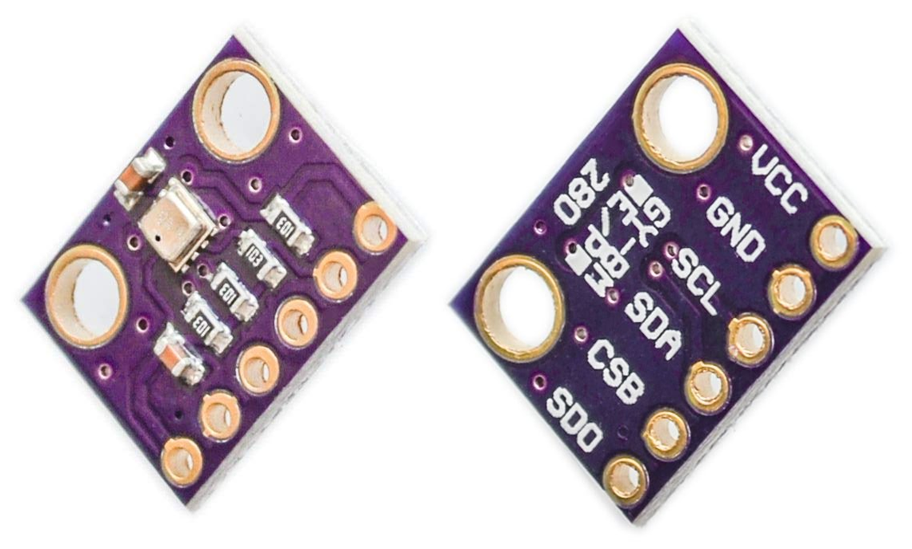

# BME280_I2C
BME280 library for I2C interface.  
Using this library, BME280 can be easying used with I2C interface of ESP32.  
  
I2C インターフェース用 BME280 ライブラリです。  
このライブラリを使用することで ESP32 の I2C インターフェース接続で BME280 を簡単に使用できます。  
  
## Overview
This library assume for use with 'PlatformIO' or 'Arduino core for ESP32'.  
BME280 is a multi-function sensor from BOSCH that can measure temperature, humidity and atmospheric pressure.  
  
このライブラリは "PlatformIO" または "Arduino core for ESP32" での使用を想定しています。  
BME280 は BOSCH社製が提供する多機能センサーで 温度・湿度・大気圧 を計測できるマルチセンサーです。  
  

  
## Usage
This library support only BME280 connected with I2C interface.  
  
And using this library, BME280 can be easying used with I2C interface of ESP32.  
For use this library, install bellow libraries to your development environment.
  
このライブラリは、I2Cインターフェイスに接続されたBME280のみをサポートしています。  
  
このライブラリを使用することで ESP32 の I2C インターフェース接続で BME280 を簡単に使用できます。  
開発環境に 以下のライブラリを導入してください。  
  
- Wire  
  
  ```
  "Wire.h" is used inside "BME280_I2C.h".

  "Wire.h" は "BME280_I2C.h" の内部で使用されます。
  ```
  
## Example
As follows, an example of how to use this library.
  
以下に、使い方を例示します。  
  
### **Preparing to use BME280_I2C on PlatformIO IDE VScode plugin**
Following example is used Wemos Lolin32 board which is ESP32 with 128x64 SSD1306 I2C OLED display.  
With PlatformIO IDE, you can create a configuration file following the wizard. 
  
下記は WEMOS lolin32 ( 128x64 SSD1306 コントローラー I2C 接続 OLED ディスプレイ搭載の ESP32 ボード ) を使った例です。  
PlatformIO IDE では ウィザードに従って簡単に作成できます。  
  
#### platform.ini
```ini
[env:lolin32]
platform = espressif32
board = lolin32
framework = arduino
lib_deps = Wire, BME280_I2C   # be sure to set additionally
```
  
### **Preparing to use BME280_I2C on Arduino IDE**
Get zip archived file from GitHub Repository.  
And install to Arduino IDE from following menu block.  
  
GitHub のリポジトリから zip 形式で入手します。  
そして Arduino IDE の 以下のメニュー項目からインストールします。  
  
```
[Sketch] → [Include library] → [Add .ZIP Library] → Choose BME280_I2C-master.zip
```
### **How to use BME280_I2C in your code**
Write your code like following.  
  
以下のように実装していきます。  
  
#### your_code.ino
```C++
#include <BME280_I2C.h>

// define the wiring settings for I2C interface connection.
#define BME280_I2C_SCL    26
#define BME280_I2C_SDA    25
#define BME280_FREQUENCY  400000

// define the instance of BME280_I2C class.
BME280_I2C bme280;

// set address and connected pins.
// since the address of BME280 is defined in the header file.
// it changes according to the setting of BME280.
bme280.setAddress(BME280_ADDRESS, BME280_I2C_SDA, BME280_I2C_SCL);

// as follows, you can also omit setAddress() by intantiating the class.
// BME280_I2C bme280(BME280_ADDRESS, BME280_I2C_SDA, BME280_I2C_SCL);

// and then begin the sensor.
// each parameter uses the enum values ​​defined in the header file.
// typically, SPI mode uses BME280_SPI3_DISABLE because it is for I2C.
bme280.begin(standby_time, filter, spi_mode, temp_oversampling, pres_oversampling, humi_oversampling, exec_mode);

// read values from BME280.
// and the calibrated values is storeed to BME280.data in the library.
// the stored data is temperature, atmospheric pressure, humidity and altitude.
bme280.read();
```
  
## Download and Install
Download and Install of this library is supported by GitHub and PlatformIO.  
  
このライブラリのダウンロードおよびインストールは GitHub と PlatformIO でサポートされています。  
  
- GitHub  
  https://github.com/ks-tec/BME280_I2C
  
    How to installation, it is download zip archived file from following link.  
    And import the file to your environment.  
    https://github.com/ks-tec/BME280_I2C/archive/master.zip
  
- PlatformIO  
  https://platformio.org/lib/show/7143/BME280_I2C

    How to installation, it is writen in the following link.  
    And follow the description.  
    https://platformio.org/lib/show/7143/BME280_I2C/installation
  
## TODO Tasks
- [x] Getting the sea-level pressure every hour  
~~Now defined constant value in header file is 1 atmospheric pressure. (1 atmospheric pressure = 1013.25 hPa)~~  
The function was added at ver.1.3.0, and fixed bug at ver.1.3.1 .  
Getting hourly data is beyond the scope of the library, so set the value of sea-level pressure.  
  
  ```
  Getting and setting the sea-level pressures timely (ex. every hour), allows for calculating more right altitude.
  
  適時 (例：１時間ごと）に海面気圧を取得および設定することで、より適切な高度を計算できます。
  ```
  
## Refered Site
- BME280 – スイッチサイエンス  
http://trac.switch-science.com/wiki/BME280  
Original License is Unkown  
  
- adafruit/Adafruit_BME280_Library: Arduino Library for BME280 sensors  
https://github.com/adafruit/Adafruit_BME280_Library  
  
- BME280温湿度・気圧センサーの動作確認  
https://kazz12211.wordpress.com/2016/03/10/bme280%e6%b8%a9%e6%b9%bf%e5%ba%a6%e3%83%bb%e6%b0%97%e5%9c%a7%e3%82%bb%e3%83%b3%e3%82%b5%e3%83%bc%e3%81%ae%e5%8b%95%e4%bd%9c%e7%a2%ba%e8%aa%8d/  
  
- BME280 とesp32で温度・湿度・気圧を測定する  
https://raspberry-pi.nomad-life.net/1928977/memo/esp32%e3%81%a7%e6%b8%a9%e5%ba%a6%e3%83%bb%e6%b9%bf%e5%ba%a6%e3%83%bb%e6%b0%97%e5%9c%a7%e3%82%92%e8%a8%88%e6%b8%ac%e3%81%99%e3%82%8b  
  
## Change log
(1.3.2)  
Scrutinized the code content.  
  
コード内容を精査しました。  
  
(1.3.1)  
Fixed bug at setSeaLevelPressure() function.  
  
setSeaLevelPressure() 関数の不具合を修正しました。  
  
(1.3.0)  
Added function that set sea-level pressure.  
  
海面気圧を設定する関数を追加しました。  
  
(1.2.0)  
Added calculate altitude function.  
It can be obtained with data.altitude, and just needs to call read() function as before.  
  
標高を計算する関数 calculateAltitude() を追加しました。  
data.altitude で取得でき 従来どおり read() 関数の呼び出しのみで済みます。  
  
(1.1.0)  
Changed specifications of the begin() function.  
Changed to set BME280 address and connected pins using constructor or setAddress() function.  
  
BME280_I2C クラスの begin() 関数の仕様を変更しました。  
BME280 のアドレスおよび接続ピンの設定は コンストラクタ または setAddress() 関数を使用するように変更しました。  
  
(1.0.0)  
First released.  
  
最初のリリースです。  
  
## Credits and license
The MIT License (MIT)  
Copyright (c) 2020, ks-tec.
